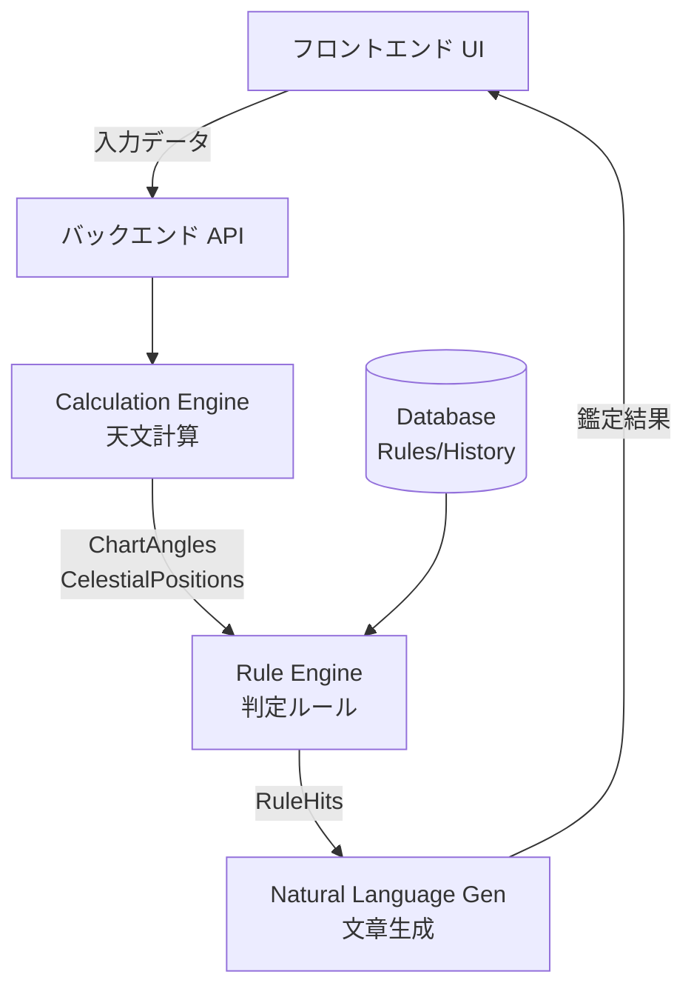

# 七政四余・命盤作成／鑑定アプリ システム設計書

## 1. アプリの全体像
生年月日、出生時刻、出生地に基づき、七政四余の命盤を計算・表示し、初心者にも理解しやすい日本語の鑑定文を提供するWebアプリケーションです。
最大の特徴は、**「天文計算」「判定ルール」「文章生成」の3層を完全に分離**している点です。これにより、流派ごとのルールの違いをデータ駆動で切り替え可能にし、ブラックボックス化を防ぎます。鑑定結果には必ず出典と根拠（なぜその解釈になったか）を明示し、ユーザーに誠実な占術体験を提供します。

## 2. MVPで実装する機能（フェーズ2範囲）
初期リリース（MVP）では、基本となる天体位置の計算と、中核となる命盤の可視化に集中します。
* **基本入力**: 氏名、生年月日、出生時刻、出生地（緯度経度・タイムゾーン）の入力フォーム
* **天文計算**: 七政（太陽・月・水・金・火・木・土）、羅睺・計都、月孛の天体位置計算
* **基本ルール**: 十二宮・二十八宿の配置、命宮・命度・命度主の算出、星曜の落宮・落宿判定
* **可視化**: SVGまたはCanvasを用いた円形チャートの描画と、計算結果の表形式（データテーブル）表示
* **基本判定**: 五行の生剋制化に基づく基本的な相性・状態判定

## 3. 実装を保留する機能（拡張機能）
以下の機能は、計算ロジックの不確実性や機能の複雑さを考慮し、初期MVPからは除外し、フェーズ3以降で段階的に実装します。
* **紫氣の計算**: 流派により異説が多いため、複数の計算方式の出典が確認できるまで保留。
* **高度な神殺・格局**: 複雑な条件分岐を伴う特殊ルール。
* **運気予測**: 大限、小限、年運、月運などの時間経過に伴う変化の計算。
* **AI自然言語生成**: ルールエンジンが安定するまでは、定型文の組み合わせとし、動的AI生成は後回しとする。
* **インフラ機能**: ユーザー認証、鑑定履歴のクラウド保存、PDF/PNG出力、決済機能。

## 4. 技術構成
* **フロントエンド**: React (Vite), TypeScript, Tailwind CSS
* **命盤描画**: Reactを用いたインラインSVG生成（高解像度対応・レスポンシブ）
* **バックエンド (将来)**: Node.js (Express), TypeScript (本フェーズではフロントエンド内でモックまたは軽量計算を実行)
* **データベース (将来)**: PostgreSQL, Drizzle ORM (ルールセットや鑑定履歴の保存)
* **天文計算**: ephemeris.js または Moshier ephemeris の移植版（商用利用可能なオープンソースライブラリを採用）

## 5. システム構成図


## 6. データモデル
* **`BirthInput`**: 生年月日、時刻、緯度経度、タイムゾーン、精度フラグ
* **`CelestialPosition`**: 天体名、黄経、黄緯、赤経、赤緯、順逆フラグ
* **`ChartAngles`**: 命宮、十二宮境界、東の地平線、二十八宿境界
* **`Rule`**: ルールID、流派、条件式（JSON Logic等）、解釈テンプレート、出典
* **`RuleHit`**: Ruleが合致した結果。優先度、根拠データ（evidence）を保持。

## 7. 天文計算フロー
1. 出生地・日時の入力から UTC への変換。
2. UTC から ユリウス日 (Julian Day) への変換。
3. 天文計算ライブラリを用いた地心座標（黄経・黄緯など）の算出。
4. 歳差補正と座標系変換（恒星黄道・移動黄道など、設定に基づく変換）。
5. 十二宮（黄道を30度ずつ分割）、二十八宿（基準星に基づく分割）へのマッピング。
6. 出生時刻に基づく命宮・東の地平線（アセンダント相当）の算出。

## 8. 七政四余ルールエンジンの構造
ルールはソースコードにハードコードせず、JSON等のデータ駆動型で定義します。
```json
{
  "ruleId": "r001",
  "name": "太陽・獅子宮（升殿）",
  "condition": { "and": [{ "==": ["target", "Sun"] }, { "==": ["house", "Leo"] }] },
  "interpretation": "太陽が本来の座にあり、強いエネルギーを持ちます。",
  "source": "『星学大成』巻X",
  "version": "1.0.0"
}
```
エンジンは `ChartAngles` と `CelestialPosition` を入力として全ルールを評価し、合致したものを `RuleHit` 配列として出力します。

## 9. 主要画面のワイヤーフレーム
* **ナビゲーション**: 命盤作成 / 基礎知識 / 流派設定 / 履歴
* **命盤作成画面**: 左側に円形チャート（SVG）、右側にタブ切り替え（データ表 / 鑑定結果 / 用語解説）。
* **鑑定結果画面**: アコーディオン形式で「全体要約」「中心的性質」「才能と仕事」などを表示。各項目の横に ( i ) アイコンで根拠と出典をポップアップ表示。

## 10. 開発手順
* **フェーズ1**: 要件整理、仕様策定、UIプロトタイプの作成（現在）
* **フェーズ2**: 天文計算アダプターの実装、円形チャート描画、基本データ表の表示（MVP）
* **フェーズ3**: ルールエンジンの構築、RuleHitの生成、定型文による鑑定結果表示
* **フェーズ4**: 鑑定履歴保存、PDF出力、AIによる高度な文章生成、管理画面

## 11. 検証方法
* **単体テスト**: UTC変換、ユリウス日計算、十二宮・二十八宿境界、逆行判定の境界値テスト。
* **ゴールデンテスト**: 専門家が作成した「基準命盤」データを用意し、計算結果（黄経度数など）の誤差が許容範囲内（例: 0.1度以内）に収まるかをCI/CDで自動検証。

## 12. ライセンス上の注意
* 高精度の天文計算として有名な Swiss Ephemeris は **GPLライセンス** および商用デュアルライセンスです。本番環境でクローズドソースの商用サービスとする場合、ライセンス違反になるリスクがあります。
* 回避策として、パブリックドメインの計算ロジック（Moshierのephemeris等）や、MIT/Apacheライセンスのライブラリへの置き換えを前提とした `EphemerisProvider` インターフェースによる抽象化を実装します。

## 13. 不明な計算ルールの一覧（今後の調査事項）
* **紫氣の計算式**: 28日周期説、木星の遠日点説など流派によって解釈が分かれています。
* **二十八宿の境界度数**: 歳差運動を考慮した現代の天文学的境界を使用するか、特定の時代の固定度数（古法）を使用するかの標準設定。
* **命度の算出**: 太陽の度数に基づく比例配分か、太陰を用いるか、その他の算出方法の厳密な定義。
* **時刻不明時の制御**: 命宮が定まらない場合の、代替となる占術的フォールバック手法の有無。
